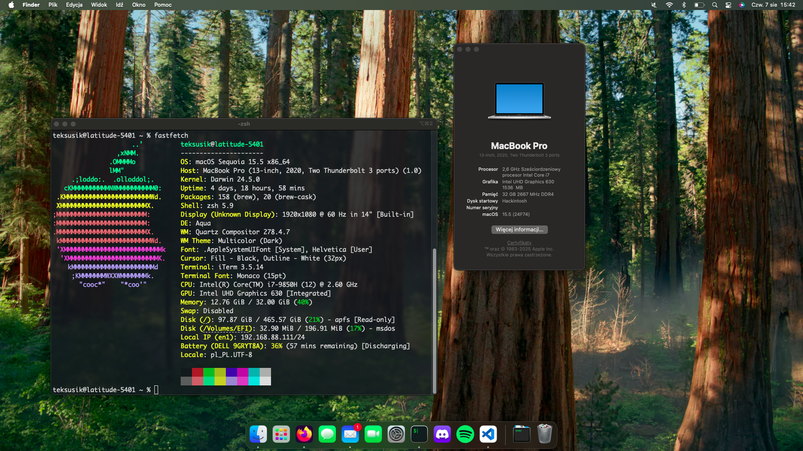

## Specification
| **Component** | **Model** |
| ------------- | --------- |
| CPU | Intel Core i7-9850H @ 2.6GHz to 4.6GHz |
| RAM | 32GB (2 x 16GB) @ 2667MHz |
| GPU | Intel UHD Graphics 630 |
| OS Disk | Lexar NM790 2TB |
| Ethernet | Intel I219-LM |
| WiFi & Bluetooth | Fenvi BCM94360NG |

**macOS version:** macOS Sequoia 15.0 (24A335)  
**OpenCore version:** 1.0.0 + OCLP  
**SMBIOS:** MacBookPro16,3  

## Software compatibility
 - Sequoia (15.x)
 - Sonoma (14.x)
 - Ventura (13.x)
 - Monterey (12.x)
 - Big Sur (11.x)
 - Earlier versions alo should work but are not tested

## Hardware compatibility
### CPU
This EFI is compatible with Intel Core Laptop Coffee Lake Plus (9XXX) processors.

### GPU
This EFI is compatible only with Intel UHD Graphics 630.

### Networking
#### Wired
Intel NICs are supported. To use other NICs you must use a diffrent kexts.
#### Wireless
Fenvi BCM94360NG and BCM94352Z works on Somona after applying OCLP root patches and supports features like AirDrop, Continuity, etc. Before Sonoma, it works out of the box. To use other wireless cards you must use kexts.

### BIOS Settings
In addition to setting the BIOS settings given in the OpenCore guide, you need to set a few things in the BIOS that are not available through settings. To do this, you need to use the `setup_var.efi` application and set the offsets according to your laptop model and BIOS version. To be sure of the settings offsets, I recommend extracting your current BIOS. Detailed instructions are available online. I recommend caution, these actions may damage your laptop.  
CFG Lock: Disabled  
DVMT Pre-Allocated: 64M  
DVMT Total Gfx Mem: MAX  

Settings for my laptop and BIOS:
```
// CFG Lock
0x6ED set to 0x00
// Overclocking Lock
0x789 set to 0x00
// DVMT Pre-Allocated
0xA11 set to 0x02
// DVMT Total Gfx Mem
0xA12 set to 0x03
```

## Security
This build has security features such as Secure Boot, System Integrity Protection, and Apple Mobile File Integrity disabled due to the application of OpenCore Legacy Patcher patches. FileVault is also unavailable.  

## Installation
 1. Use [this](https://dortania.github.io/OpenCore-Install-Guide/installer-guide/) guide to create USB with macOS recovery.
 2. Clone this repository and copy "BOOT" and "OC" directories to "EFI" directory on your USB.
 3. Modify "MLB", "ROM", "SystemSerialNumber" and "SystemUUID" in EFI/OC/config.plist using [GenSMBIOS](https://github.com/corpnewt/GenSMBIOS) script with MacBookPro16,3 SMBIOS. You can find more detailed instructions [here](https://dortania.github.io/OpenCore-Install-Guide/config.plist/kaby-lake.html#platforminfo).
 4. Follow [Dortania](https://dortania.github.io/OpenCore-Post-Install/) post-install guide.

## Credits
 - [[Bootloader] OpenCore](https://github.com/acidanthera/OpenCorePkg)
 - [[SSDT] SSDT-AWAC](https://github.com/dortania/Getting-Started-With-ACPI/blob/master/extra-files/compiled/SSDT-AWAC.aml)
 - [[SSDT] SSDT-EC-USBX-LAPTOP](https://github.com/dortania/Getting-Started-With-ACPI/blob/master/extra-files/compiled/SSDT-EC-USBX-LAPTOP.aml)
 - [[SSDT] SSDT-PLUG-DRTNIA](https://github.com/dortania/Getting-Started-With-ACPI/blob/master/extra-files/compiled/SSDT-PLUG-DRTNIA.aml)
 - [[SSDT] SSDT-PMC](https://github.com/dortania/Getting-Started-With-ACPI/blob/master/extra-files/compiled/SSDT-PMC.aml)
 - [[SSDT] SSDT-PNLF](https://github.com/dortania/Getting-Started-With-ACPI/blob/master/extra-files/compiled/SSDT-PNLF.aml)
 - [[Driver] AudioDxe](https://github.com/acidanthera/OpenCorePk)
 - [[Driver] HFSPlus](https://github.com/acidanthera/OcBinaryData/blob/master/Drivers/HfsPlus.efi)
 - [[Driver] OpenRuntime](https://github.com/acidanthera/OpenCorePkg)
 - [[Driver] OpenCanopy](https://github.com/acidanthera/OpenCorePkg)
 - [[Driver] ResetNvramEntry](https://github.com/acidanthera/OpenCorePkg)
 - [[Kext] Lilu](https://github.com/acidanthera/Lilu)
 - [[Kext] VirtualSMC](https://github.com/acidanthera/VirtualSMC)
 - [[Kext] WhateverGreen](https://github.com/acidanthera/WhateverGreen)
 - [[Kext] AppleALC](https://github.com/acidanthera/AppleALC)
 - [[Kext] IntelMausi](https://github.com/acidanthera/IntelMausi)
 - [[Kext] USBToolBox](https://github.com/USBToolBox/kext)
 - [[Kext] BrightnessKeys](https://github.com/acidanthera/BrightnessKeys)
 - [[Kext] NVMeFix](https://github.com/acidanthera/NVMeFix)
 - [[Kext] RestrictEvents](https://github.com/acidanthera/RestrictEvents)
 - [[Kext] AlpsHID](https://github.com/blankmac/AlpsHID)
 - [[Kext] VoodooI2C](https://github.com/VoodooI2C/VoodooI2C)
 - [[Kext] VoodooPS2](https://github.com/acidanthera/VoodooPS2)
 - [[Kext] IOSkywalk](https://github.com/dortania/OpenCore-Legacy-Patcher/tree/main/payloads/Kexts/Wifi)
 - [[Kext] IO80211FamilyLegacy](https://github.com/dortania/OpenCore-Legacy-Patcher/tree/main/payloads/Kexts/Wifi)
 - [[Tool] ProperTree](https://github.com/corpnewt/ProperTree)
 - [[Tool] GenSMBIOS](https://github.com/corpnewt/GenSMBIOS) 
 - [[Tool] MountEFI](https://github.com/corpnewt/MountEFI) 
 - [[Tool] ocvalidate](https://github.com/acidanthera/OpenCorePkg) 
 - [[Tool] OCConfigCompare](https://github.com/corpnewt/OCConfigCompare) 
 - [[Tool] setup_var.efi](https://github.com/datasone/setup_var.efi)
 - [Dortania](https://dortania.github.io/) for config guides